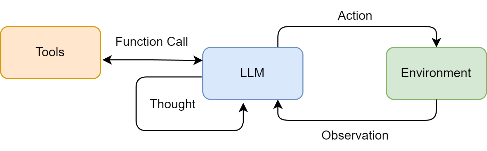
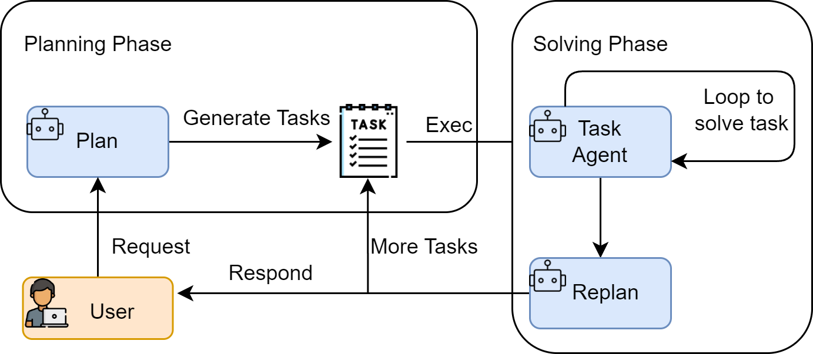
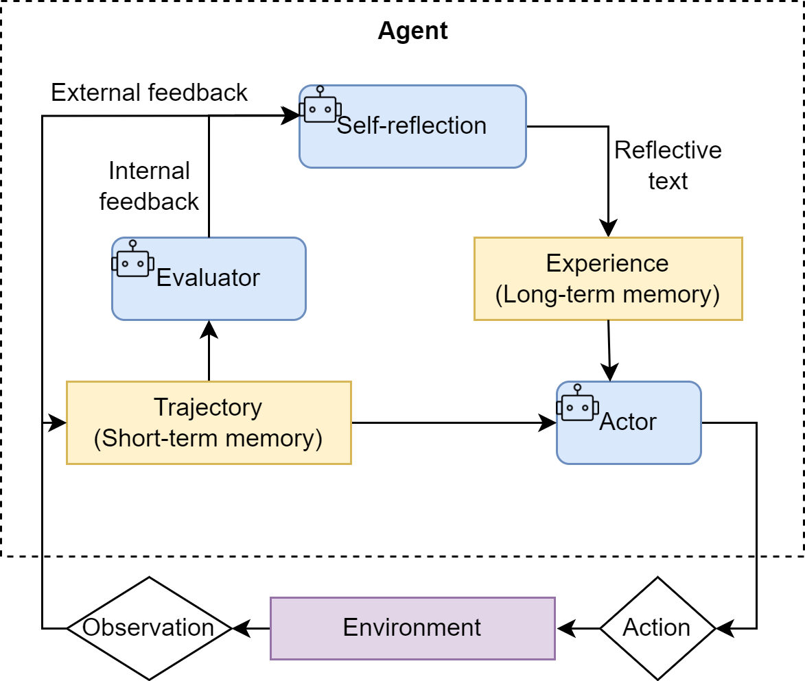

随着大语言模型（LLM）能力的不断提升，AI Agent已经成为构建智能应用的重要范式。Agent不仅仅是一个简单的问答模型，而是能够**自主规划、使用工具、与环境交互**的智能系统。本文将介绍三种主流的Agent设计范式，帮助你理解它们的工作原理和适用场景。

## ReAct



ReAct（Reasoning + Acting）是一种将**推理（Reasoning）**和**行动（Acting）**相结合的Agent范式。它模仿人类解决问题的方式：我们会先思考，然后采取行动，观察结果，再根据观察继续思考，如此循环直到问题解决。

### 原理与工作流程

ReAct的核心循环可以概括为 **Thought → Action → Observation**：

1. **Thought（思考）**：Agent分析当前情况，理解问题，决定下一步需要做什么
2. **Action（行动）**：根据思考结果，选择并执行合适的工具/动作
3. **Observation（观察）**：获取行动的结果反馈，包括成功或失败的信息
4. **循环往复**：基于新的观察，再次进行思考，如此循环直到完成任务或达到终止条件

如上图所示，Agent处于核心位置，与三个关键组件交互：
- **Tools（工具）**：Agent可调用的外部能力，如搜索引擎、计算器、数据库查询、API调用等
- **LLM（大语言模型）**：提供推理和决策能力，生成Thought和Action
- **Environment（环境）**：执行Action并返回Observation的外部世界

### 特点与局限性

**特点：**
- **透明度高**：每一步都有明确的思考过程，像"独白"一样展示推理逻辑，便于理解和调试
- **动态决策**：根据环境反馈实时调整策略，而非一成不变地执行预定计划
- **错误恢复**：当某一步出错时，可以通过后续推理进行修正，具有自我纠错能力
- **人机友好**：清晰的推理链条便于人类理解Agent的决策过程，也方便人工介入

**局限性：**
- **上下文消耗大**：需要保留完整的思考-行动-观察历史，对于复杂任务会占用大量Token
- **单步决策局限**：缺乏全局规划，可能在复杂任务中陷入局部最优，导致效率低下
- **效率问题**：即使简单的任务也需要多轮推理，不如直接执行高效
- **工具依赖**：效果受限于可用工具的质量和覆盖范围，工具不足时效果大打折扣

### 代码实现

```python
import json
from typing import List, Dict, Any, Callable

class ReActAgent:
    """ReAct Agent: 思考-行动-观察循环"""
    
    def __init__(self, llm_client, tools: Dict[str, Callable]):
        self.llm = llm_client
        self.tools = tools
        self.memory = []  # 存储交互历史
        
    def think(self, query: str) -> str:
        """生成思考内容，决定下一步行动"""
        prompt = self._build_prompt(query)
        response = self.llm.chat(prompt)
        return response
    
    def act(self, action_name: str, action_input: str) -> str:
        """执行工具调用"""
        if action_name not in self.tools:
            return f"Error: Tool '{action_name}' not found"
        
        try:
            tool = self.tools[action_name]
            result = tool(action_input)
            return str(result)
        except Exception as e:
            return f"Error executing {action_name}: {str(e)}"
    
    def _build_prompt(self, query: str) -> str:
        """构建包含历史的prompt"""
        history = "\n".join(self.memory)
        return f"""你是一个智能助手，需要回答用户的问题。你可以使用以下工具：

{self._format_tools()}

请按照以下格式进行思考：
Thought: 你的思考过程
Action: 工具名称
Action Input: 工具输入

或者当任务完成时：
Thought: 我已经得到了最终答案
Final Answer: 你的最终回答

当前问题：{query}

历史记录：
{history}"""
    
    def _format_tools(self) -> str:
        """格式化工具列表"""
        return "\n".join([f"- {name}: {tool.__doc__}" 
                         for name, tool in self.tools.items()])
    
    def parse_response(self, response: str) -> Dict[str, str]:
        """解析LLM响应，提取Thought、Action和Action Input"""
        result = {}
        
        # 提取Thought
        if "Thought:" in response:
            thought = response.split("Thought:")[1].split("Action:")[0].strip()
            result["thought"] = thought
        
        # 提取Action
        if "Action:" in response and "Final Answer:" not in response:
            action = response.split("Action:")[1].split("Action Input:")[0].strip()
            result["action"] = action
            action_input = response.split("Action Input:")[1].strip()
            result["action_input"] = action_input
        
        # 提取Final Answer
        if "Final Answer:" in response:
            final_answer = response.split("Final Answer:")[1].strip()
            result["final_answer"] = final_answer
        
        return result
    
    def run(self, query: str, max_iterations: int = 10) -> str:
        """运行ReAct循环"""
        print(f"问题: {query}\n")
        
        for i in range(max_iterations):
            # 1. 思考
            response = self.think(query)
            parsed = self.parse_response(response)
            
            if "thought" in parsed:
                print(f"思考 {i+1}: {parsed['thought']}")
            
            # 2. 检查是否完成
            if "final_answer" in parsed:
                print(f"\n最终答案: {parsed['final_answer']}")
                return parsed["final_answer"]
            
            # 3. 执行行动
            if "action" in parsed and "action_input" in parsed:
                action_name = parsed["action"]
                action_input = parsed["action_input"]
                print(f"行动: {action_name}({action_input})")
                
                observation = self.act(action_name, action_input)
                print(f"观察: {observation}\n")
                
                # 4. 记录到记忆
                self.memory.append(f"Thought: {parsed.get('thought', '')}")
                self.memory.append(f"Action: {action_name}")
                self.memory.append(f"Action Input: {action_input}")
                self.memory.append(f"Observation: {observation}")
        
        return "达到最大迭代次数，未能完成"


# ============ 使用示例 ============

# 定义工具函数
def search(query: str) -> str:
    """搜索工具：搜索互联网获取信息"""
    search_results = {
        "北京天气": "北京今天晴，25°C，微风",
        "上海人口": "上海常住人口约2500万",
    }
    return search_results.get(query, f"未找到关于'{query}'的信息")

def calculator(expression: str) -> float:
    """计算工具：计算数学表达式"""
    try:
        return eval(expression)
    except:
        return "计算错误"

# 使用示例
if __name__ == "__main__":
    tools = {"search": search, "calculator": calculator}
    agent = ReActAgent(None, tools)  # 传入实际的LLM客户端
    result = agent.run("北京今天天气怎么样？")
```

---

## Plan-and-Execute



Plan-and-Execute（规划-执行）范式将任务解决过程分为两个明确的阶段：**规划阶段**和**执行阶段**。与ReAct的边想边做不同，这种模式先制定完整计划，再按步骤执行。

### 原理与工作流程

Plan-and-Execute的工作流程分为两个阶段：

**规划阶段（Planning Phase）：**
1. **接收用户输入**：理解用户的任务需求
2. **生成任务计划**：将复杂任务分解为一系列有序的、可执行的子任务
3. **输出任务列表**：形成结构化的执行计划

**执行阶段（Solving Phase）：**
1. **按序执行任务**：逐个执行计划中的子任务
2. **循环解决**：Task Agent专注解决当前子任务
3. **动态重规划（Replan）**：当某个步骤执行失败或遇到意外情况时，可以重新调整后续计划
4. **返回结果**：所有任务完成后，整合输出最终结果

这种模式的关键优势是**任务分解**——复杂任务被拆分为简单的、可管理的子任务，每个子任务更容易完成。

### 特点与局限性

**特点：**
- **全局视野**：先规划后执行，能够统筹全局，避免局部最优
- **模块化**：任务分解后，每个子任务可以独立优化，便于维护和复用
- **效率较高**：清晰的执行计划减少了重复思考，执行效率通常优于纯ReAct
- **可并行性**：独立的子任务可以考虑并行执行，进一步提升效率

**局限性：**
- **规划开销**：初始规划需要消耗较多时间和Token
- **计划僵化**：初始计划可能不符合实际情况，需要频繁重规划
- **依赖分解质量**：任务分解的质量直接影响最终效果，分解不当会导致执行失败
- **复杂度限制**：对于高度动态、需要大量即时决策的任务，可能不如ReAct灵活

### 代码实现

```python
from typing import List, Dict, Callable, Any

class PlanAndExecuteAgent:
    """Plan-and-Execute Agent: 先规划，后执行"""
    
    def __init__(self, llm_client, tools: Dict[str, Callable]):
        self.llm = llm_client
        self.tools = tools
        
    def plan(self, task: str) -> List[Dict[str, Any]]:
        """规划阶段：将任务分解为子任务"""
        prompt = f"""请将以下任务分解为具体的执行步骤。

任务：{task}

可用工具：{list(self.tools.keys())}

请输出JSON格式的任务列表，每个任务包含：
- task_id: 任务编号
- description: 任务描述
- tool: 使用的工具（如有）
- dependencies: 依赖的前置任务ID列表

输出格式示例：
[
    {{"task_id": 1, "description": "搜索相关信息", "tool": "search", "dependencies": []}},
    {{"task_id": 2, "description": "分析结果", "tool": null, "dependencies": [1]}}
]

请直接输出JSON："""
        
        response = self.llm.chat(prompt)
        try:
            plan = json.loads(response)
            return plan
        except:
            # 解析失败返回单步计划
            return [{"task_id": 1, "description": task, "tool": None, "dependencies": []}]
    
    def execute_task(self, task: Dict, context: Dict) -> str:
        """执行单个任务"""
        print(f"  执行任务 {task['task_id']}: {task['description']}")
        
        # 如果有指定工具，调用工具
        if task.get('tool') and task['tool'] in self.tools:
            tool_func = self.tools[task['tool']]
            # 构建输入，包含上下文
            input_data = task['description']
            if context:
                input_data += f"\n上下文: {json.dumps(context, ensure_ascii=False)}"
            result = tool_func(input_data)
            return str(result)
        else:
            # 无工具时，用LLM直接处理
            prompt = f"任务: {task['description']}\n上下文: {context}"
            return self.llm.chat(prompt)
    
    def replan(self, remaining_tasks: List[Dict], failure_reason: str) -> List[Dict]:
        """重新规划剩余任务"""
        print(f"重新规划原因: {failure_reason}")
        
        prompt = f"""由于以下原因需要重新规划：{failure_reason}

剩余任务：{remaining_tasks}

请调整计划，输出新的任务列表："""
        
        response = self.llm.chat(prompt)
        try:
            return json.loads(response)
        except:
            return remaining_tasks  # 解析失败保持原样
    
    def run(self, task: str, max_replan: int = 3) -> str:
        """执行Plan-and-Execute流程"""
        print(f"=== 原始任务 ===\n{task}\n")
        
        # 1. 规划阶段
        print("=== 规划阶段 ===")
        plan = self.plan(task)
        print(f"生成计划 ({len(plan)} 个任务):")
        for t in plan:
            print(f"  [{t['task_id']}] {t['description']}")
        print()
        
        # 2. 执行阶段
        print("=== 执行阶段 ===")
        context = {}  # 存储任务结果作为上下文
        completed_tasks = set()
        replan_count = 0
        
        while len(completed_tasks) < len(plan) and replan_count < max_replan:
            for task_def in plan:
                task_id = task_def['task_id']
                if task_id in completed_tasks:
                    continue
                
                # 检查依赖是否完成
                deps = task_def.get('dependencies', [])
                if not all(d in completed_tasks for d in deps):
                    continue
                
                # 执行任务
                try:
                    result = self.execute_task(task_def, context)
                    context[task_id] = result
                    completed_tasks.add(task_id)
                    print(f"  结果: {result[:100]}...\n")
                except Exception as e:
                    # 执行失败，尝试重规划
                    remaining = [t for t in plan if t['task_id'] not in completed_tasks]
                    plan = self.replan(remaining, str(e))
                    replan_count += 1
                    break
        
        # 3. 整合结果
        print("=== 最终结果 ===")
        final_result = "\n".join([f"任务{i+1}: {context.get(t['task_id'], '未完成')}" 
                                  for t in plan])
        return final_result


# 使用示例
if __name__ == "__main__":
    # 与ReAct相同的工具定义
    tools = {"search": search, "calculator": calculator}
    
    agent = PlanAndExecuteAgent(None, tools)
    result = agent.run("帮我搜索北京天气并计算25度换算成华氏度是多少")
```

---

## Reflection



Reflection（反思）范式是一种自我改进的Agent架构，它通过**自我评估**和**经验积累**来不断提升任务执行能力。这种范式模拟人类"从错误中学习"的能力。

### 原理与工作流程

Reflection架构包含三个核心角色和两种记忆：

**核心角色：**
1. **Actor（执行者）**：负责实际执行行动，基于当前状态和目标做出决策
2. **Evaluator（评估器）**：对Actor的行动结果进行评估，生成内部反馈
3. **Self-reflection（自我反思）**：根据外部反馈（环境结果）和内部反馈（Evaluator评估）进行深度反思

**两种记忆：**
1. **Trajectory（短期记忆）**：当前任务的执行轨迹，包括行动序列和中间结果
2. **Experience（长期记忆）**：从历史任务中提炼的经验教训，用于指导未来任务

**工作流程：**
1. Actor基于当前状态和目标执行行动
2. 行动产生Observation（观察）和外部反馈
3. Trajectory记录执行轨迹
4. Evaluator评估执行效果，生成内部反馈
5. Self-reflection综合外部和内部反馈，生成反思文本
6. 反思结果存入Experience，形成长期记忆
7. 经验反馈给Actor，用于改进后续决策

### 特点与局限性

**特点：**
- **自我改进**：能够从过去的经验中学习，越用越聪明
- **深度反思**：不仅关注执行结果，还关注过程中的决策质量
- **经验复用**：长期记忆可以在不同任务间复用，避免重复犯错
- **鲁棒性强**：通过反思和修正，对不确定环境的适应能力更强

**局限性：**
- **实现复杂**：需要多个组件协同工作，系统架构相对复杂
- **计算成本高**：评估和反思都需要额外的LLM调用，资源消耗大
- **经验累积慢**：有价值经验的积累需要时间，短期效果不明显
- **存储管理**：长期记忆的存储、检索和更新需要精心设计

### 代码实现

```python
from typing import List, Dict, Callable, Any, Optional
from dataclasses import dataclass, field
from datetime import datetime

@dataclass
class Trajectory:
    """短期记忆：当前任务的执行轨迹"""
    actions: List[Dict] = field(default_factory=list)
    
    def add_step(self, action: str, observation: str, result: str):
        self.actions.append({
            "timestamp": datetime.now().isoformat(),
            "action": action,
            "observation": observation,
            "result": result
        })
    
    def to_text(self) -> str:
        return "\n".join([
            f"步骤 {i+1}: {step['action']} -> {step['result']}" 
            for i, step in enumerate(self.actions)
        ])

@dataclass
class Experience:
    """长期记忆：经验条目"""
    situation: str  # 当时的情况
    action: str     # 采取的行动
    outcome: str    # 结果如何
    lesson: str     # 学到的教训
    timestamp: str = field(default_factory=lambda: datetime.now().isoformat())


class ReflectionAgent:
    """Reflection Agent: 反思-学习-改进"""
    
    def __init__(self, llm_client, tools: Dict[str, Callable]):
        self.llm = llm_client
        self.tools = tools
        self.experience_memory: List[Experience] = []  # 长期记忆
        
    def retrieve_relevant_experience(self, task: str) -> List[Experience]:
        """检索相关的历史经验"""
        # 简单实现：返回所有经验
        # 实际应用中可以使用向量检索
        return self.experience_memory[-5:]  # 返回最近5条
    
    def actor(self, task: str, trajectory: Trajectory, 
              relevant_exp: List[Experience]) -> Dict[str, str]:
        """Actor: 基于经验和当前状态做出决策"""
        
        exp_text = "\n".join([
            f"经验 {i+1}: {e.lesson}" for i, e in enumerate(relevant_exp)
        ]) if relevant_exp else "暂无相关经验"
        
        trajectory_text = trajectory.to_text() if trajectory.actions else "刚开始"
        
        prompt = f"""你是一个智能Agent的Actor组件，需要决定下一步行动。

任务目标：{task}

已执行步骤：
{trajectory_text}

相关历史经验：
{exp_text}

可用工具：{list(self.tools.keys())}

请输出下一步行动（JSON格式）：
{{
    "thought": "你的思考过程，考虑历史经验的建议",
    "action": "工具名称或'direct_response'",
    "input": "工具输入或直接回答的内容",
    "is_final": false  // 是否是最终答案
}}

注意：如果有相关经验，请优先遵循经验中的建议。"""
        
        response = self.llm.chat(prompt)
        try:
            return json.loads(response)
        except:
            return {"action": "direct_response", "input": response, "is_final": True}
    
    def evaluator(self, action: Dict, result: str, task: str) -> Dict[str, Any]:
        """Evaluator: 评估行动效果"""
        
        prompt = f"""评估以下行动的效果：

任务目标：{task}
执行行动：{action}
行动结果：{result}

请评估（JSON格式）：
{{
    "success": true/false,  // 是否达成了预期目标
    "score": 1-10,  // 执行质量评分
    "issues": ["问题1", "问题2"],  // 存在的问题
    "strengths": ["优点1", "优点2"]  // 做得好的地方
}}"""
        
        response = self.llm.chat(prompt)
        try:
            return json.loads(response)
        except:
            return {"success": True, "score": 7, "issues": [], "strengths": ["执行完成"]}
    
    def self_reflect(self, trajectory: Trajectory, eval_result: Dict, 
                     task: str) -> Experience:
        """Self-reflection: 生成反思和经验"""
        
        prompt = f"""基于以下执行过程进行反思，总结经验教训：

任务目标：{task}

执行轨迹：
{trajectory.to_text()}

评估结果：{eval_result}

请总结（JSON格式）：
{{
    "situation": "描述任务情况",
    "action": "主要采取了什么行动",
    "outcome": "最终结果如何",
    "lesson": "从中学到了什么，下次遇到类似情况应该怎么做"
}}

lesson应该具体、可操作，未来可以指导类似任务的执行。"""
        
        response = self.llm.chat(prompt)
        try:
            data = json.loads(response)
            return Experience(**data)
        except:
            return Experience(
                situation=task,
                action="执行了任务",
                outcome=eval_result.get("success", True),
                lesson="需要进一步分析执行情况"
            )
    
    def execute_action(self, action: Dict) -> str:
        """执行具体的行动"""
        action_name = action.get("action", "direct_response")
        action_input = action.get("input", "")
        
        if action_name == "direct_response":
            return action_input
        
        if action_name in self.tools:
            try:
                return self.tools[action_name](action_input)
            except Exception as e:
                return f"执行错误: {str(e)}"
        
        return f"未知行动: {action_name}"
    
    def run(self, task: str, max_iterations: int = 10) -> str:
        """运行Reflection Agent"""
        print(f"任务: {task}\n")
        
        # 初始化短期记忆
        trajectory = Trajectory()
        
        # 检索相关经验
        relevant_exp = self.retrieve_relevant_experience(task)
        if relevant_exp:
            print(f"检索到 {len(relevant_exp)} 条相关经验")
        
        final_result = None
        
        for i in range(max_iterations):
            # 1. Actor决策
            action = self.actor(task, trajectory, relevant_exp)
            print(f"\n步骤 {i+1}:")
            print(f"  思考: {action.get('thought', '执行中')}")
            
            # 检查是否完成
            if action.get("is_final"):
                final_result = action.get("input", "任务完成")
                print(f"  最终结果: {final_result}")
                break
            
            # 2. 执行行动
            result = self.execute_action(action)
            print(f"  行动: {action.get('action')}")
            print(f"  结果: {result}")
            
            # 3. 记录轨迹
            trajectory.add_step(
                action=str(action), 
                observation="执行完成", 
                result=result
            )
        
        # 4. 评估与反思
        print("\n=== 评估与反思 ===")
        eval_result = self.evaluator(action, final_result or result, task)
        print(f"评估得分: {eval_result.get('score', 'N/A')}/10")
        
        # 生成经验
        experience = self.self_reflect(trajectory, eval_result, task)
        self.experience_memory.append(experience)
        print(f"\n学到经验: {experience.lesson}")
        print(f"经验库数量: {len(self.experience_memory)}")
        
        return final_result or result


# 使用示例
if __name__ == "__main__":
    tools = {"search": search, "calculator": calculator}
    
    agent = ReflectionAgent(None, tools)
    
    # 第一次执行
    print("=" * 50)
    result1 = agent.run("搜索北京天气")
    
    # 第二次执行（可以利用第一次的经验）
    print("\n" + "=" * 50)
    result2 = agent.run("搜索上海天气")  # 类似任务，可能复用经验
```

---

## 三种范式对比

| 特性 | ReAct | Plan-and-Execute | Reflection |
|------|-------|------------------|------------|
| **核心思想** | 边想边做，小步快跑 | 先规划后执行，按部就班 | 反思学习，持续改进 |
| **适用场景** | 需要频繁调整策略的任务 | 步骤明确、可分解的复杂任务 | 需要长期积累经验的任务 |
| **执行效率** | 中 | 高（无重规划时） | 低（初次）→ 高（有经验后） |
| **灵活性** | 高 | 中 | 高 |
| **实现难度** | 低 | 中 | 高 |
| **Token消耗** | 高 | 中 | 高 |
| **可解释性** | 高 | 中 | 高 |

## 总结

三种Agent范式各有优劣，实际应用中往往**组合使用**：

- **ReAct**适合探索性任务，需要频繁调整策略的场景
- **Plan-and-Execute**适合步骤清晰、可以预先规划的任务
- **Reflection**适合需要长期运行、积累经验的Agent系统

随着LLM能力的提升，Agent范式也在不断演进。理解这些基础范式，有助于你根据实际需求设计合适的Agent架构。

---

**参考资源：**
- ReAct: [ReAct: Synergizing Reasoning and Acting in Language Models](https://arxiv.org/abs/2210.03629)
- Plan-and-Execute: LangChain Plan-and-Execute Agent
- Reflection: [Reflexion: Self-Reflective Agents](https://arxiv.org/abs/2303.11366)
